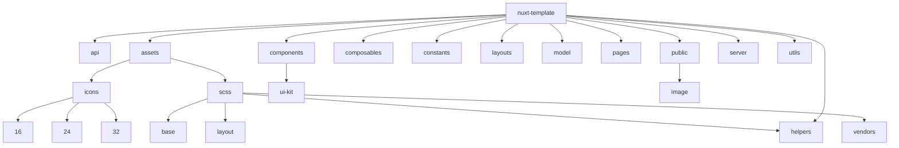

# Оглавление

0. [Минимальные требования перед запуском проекта](#Минимальные-требования-перед-запуском-проекта)
1. [Используемый стек](#Используемый-стек)
2. [Code style](#Code-style)
3. [Как включить авто форматирование кода в различных IDE](#Как-включить-авто-форматирование-кода-в-различных-IDE)
4. [Структура проекта](#Структура-проекта)
5. [Команды](#Команды)
6. [](#)

# Минимальные требования перед запуском проекта

Ознакомиться с [используемым стеком](#Используемый-стек), хотя бы частично.

Установить минимальную версию `Node.js`: v18.20.4 (LTS)

Установить минимальную версию `npm`: v10.7.0 (Latest)

# Используемый стек

- Фреймворк - [nuxt 3 @3.12.4](https://nuxt.com/docs/getting-started/introduction) 
- Язык - [typescript @5.5.3](https://www.typescriptlang.org/docs/)
- Глобальное хранилище - [@pinia/nuxt @0.5.1](https://nuxt.com/modules/pinia)
- Ui библиотека - [shadcn-nuxt @0.10.4](https://www.shadcn-vue.com/docs/installation/nuxt.html)
- Линтеры - [@nuxt/eslint @0.3.13](https://eslint.nuxt.com/), [husky @9.1.4](https://github.com/typicode/husky), [lint-staged @15.2.7](https://github.com/lint-staged/lint-staged)
- Препроцессор - [SASS @1.77.8](https://sass-lang.com/)
- Работа с SVG - [nuxt-svgo @4.0.2](https://github.com/cpsoinos/nuxt-svgo)

# Code style

Несмотря на то, что на проекте используется автоматическое форматирование кода (как его включить [читать тут](#Как-включить-авто-форматирование-кода-в-различных-IDE)), 
есть вещи которые нужно контролировать самому **(иначе получите втык от ревьюера)** 

## Нэйминг

- Формат имен файлов - **kebab-case** 
- Формат названий констант - **SCREAM_CASE**
- Формат названий функций и переменных - **camelCase**
- Формат названий CSS селекторов - [БЭМ](https://ru.bem.info/methodology/css/)
- Формат названий иконок - **PascalCase** + Icon, пример:
```vue
<script>
import AdminIcon from '@/assets/icons/16/admin.svg';
import AdminBadgeIcon from '@/assets/icons/24/admin-badge.svg';
</script>

<template>
    <AdminIcon />
    <AdminBadgeIcon />
</template>
```

# Как включить авто форматирование кода в различных IDE

## VS Code

1. Скачать плагин [ESLint](https://marketplace.visualstudio.com/items?itemName=dbaeumer.vscode-eslint)
2. В настройках пользователя `VS Code` (`settings.json`) добавить следующие параметры:
```json
{
  "eslint.format.enable": true,
  "editor.codeActionsOnSave": {
    "source.fixAll.eslint": "explicit"
  },
  "eslint.run": "onSave"
}
```
3. Перезапустить `IDE`

## Webstorm

1. Зайти в настройки `Settings`
2. Вбить в поиске `ESLint`
3. Внутри `ESLint` выбрать пункт `Automatic ESLint configuration` и поставить галочку в графе `Run eslint --fix on save`
4. Перезапустить `IDE`

Теперь при сохранении файла будет выполняться авто форматирование кода.

# Структура проекта

В этом разделе будет подробно (по возможности) описана структура проекта, чтобы не возникало вопросов, что, где и почему

Общая структура проекта будет выглядеть следующим образом:



Дальше разберем каждую по отдельности

## 📁 /api

В данной директории будут находиться функции-запросы, разделенные по модулям, т.е. модуль авторизации (auth.ts), 
модуль работы с пользователем (user.ts) и т.д.

Это поможет нам скомпоновать идентичные запросы в одном месте и избавит нас от дублирования одинаковых запросов.

❗Исключением является запрос, который существует конкретно на одной странице и в одном месте, тогда
создание модуля избыточно.

## 📁 /assets

В данной директории будут находиться иконки и стили, которые доступны всему проекту

### 📁 /icons

Иконки (❗only SVG) разделяем по размерам, т.е. 16/20/24/32 и т.д. в пикселях

```
icons/
|
|- 16/
|
|- 24/
|
|- 32/
```

### 📁 /scss

Все файлы с расширением `.scss` начинаются с префикса `_`, за исключением `main.scss` - он является основным.

Директория разделена на 4 подпапки:

- base - базовые стили, которые применяются ко всем элементам на сайте
- helpers - вспомогательные стили, которые облегчают разработку, такие как миксины, переменные и т.д.
- layout - стили для разметки сайта
- vendors - стили для внешних библиотек или фреймворков

```
scss/
|
|- base/
|  |- _normalize.scss      // Стандартные стили
|  |- _typography.scss     // Типография: h1-h4, p и т.д.
|
|- helpers/
|  |- _mixins.scss         // Миксины SCSS
|  |- _variables.scss      // Переменные цветов, размеров и т.д.
|
|- layout/ (по необходимости)
|  |- _header.scss         // Header
|  |- _footer.scss         // Footer
|  |- _sidebar.scss        // Sidebar
|
|- vendors/ (по необходимости)
|  |- _notifications.scss  // Notifications
|
- main.scss                // Главный SCSS файл
```

## 📁 /components

В данной директории будут находиться все компоненты вашего приложения.

### 📁 /ui-kit

Тут будут лежать все компоненты ui-kit-а (в нашем случае `shadcn-nuxt`), а также все "глупые" компоненты 
(т.е. сами они ничего не могут, в основном служат для отображения входных данных).

## 📁 /constants

В данной директории будут находиться все статичные переменные, используемые в проекте, включая endpoints. 

## 📁 /helpers

В данной директории будут находиться все вспомогательные функции, например:

- parse-error.ts - парсинг ошибок
- text-helper.ts - различная конвертация текста
- mobile-check.ts - проверка устройства

## 📁 /layouts

В данной директории будут находиться все слои вашего приложения, например header, footer и т.д.

## 📁 /model

В данной директории будут находиться общие типы, интерфейсы и енамы, которые используются несколько раз в разных местах,
т.е. если вы видите, что какой-то interface или type используется повторно - не поленитесь и вынесите его в общий файл,
вместо того, чтобы заниматься копипастом.

## 📁 /pages

В данной директории будут находиться все ваши страницы.

## 📁 /public

В данной директории будут находиться фав-иконки и различные изображения.

### 📁 /image

Тут будут лежать изображения в формате .png, .webp и т.д.

## 📁 /utils

В данной директории будут находиться все служебных функции, например:

- error-notification.ts - функция для отображения ошибок

# Команды

## Установка

Обязательно установите зависимости:

```bash
npm install
```

## Запуск локальной версии

Запустите сервер разработки на `http://localhost:3000` (если не занят):

```bash
npm run dev
```

## Сборка проекта

Сборка для продакшена:

```bash
npm run build
```

Локальный предварительный просмотр сборки:

```bash
npm run preview
```

Для получения дополнительной информации ознакомьтесь с [документацией по развертыванию](https://nuxt.com/docs/getting-started/deployment).
