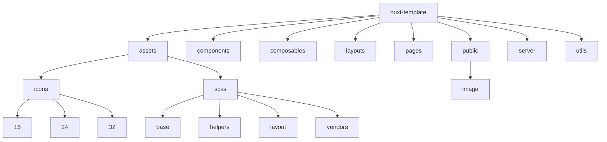

# Минимальные требования перед запуском проекта

Ознакомиться с [документацией Nuxt 3](https://nuxt.com/docs/getting-started/introduction) хотя бы частично.

Минимальная версия `Node.js`: v18.20.4 (LTS)

Минимальная версия `npm`: v10.7.0 (Latest)

# Структура проекта

В этом разделе будет подробно (по возможности) описанна структура проекта, чтобы не возникало вопросов, что, где и почему

Общая структура проекта будет выглядеть следующим образом:



Дальше разберем каждую по отдельности

## assets/

В данной директории будут находиться иконки и стили, которые доступны всему проекту

### icons/

Иконки (only SVG) разделяем по размерам, т.е. 16/20/24/32 и т.д. в пикселях

```
icons/
|
|- 16/
|
|- 24/
|
|- 32/
```

### scss/

Все файлы с расширением `.scss` начинаются с префикса `_`, за исключением `main.scss` - он является основным.

Дирректория разделена на 4 подпапки:

- base - базовые стили, которые применяются ко всем элементам на сайте
- helpers - вспомогательные стили, которые облегчают разработку, такие как миксины, переменные и т.д.
- layout - стили для разметки сайта
- vendors - стили для внешних библиотек или фреймворков

```
scss/
|
|- base/
|  |- _normalize.scss      // Стандартные стили
|  |- _typography.scss     // Типография: h1-h4, p и т.д.
|
|- helpers/
|  |- _mixins.scss         // Миксины SCSS
|  |- _variables.scss      // Переменные цветов, размеров и т.д.
|
|- layout/ (по необходимости)
|  |- _header.scss         // Header
|  |- _footer.scss         // Footer
|  |- _sidebar.scss        // Sidebar
|
|- vendors/ (по необходимости)
|  |- _notifications.scss  // Notifications
|
- main.scss                // Главный SCSS файл
```

## Setup

Make sure to install the dependencies:

```bash
# npm
npm install

# pnpm
pnpm install

# yarn
yarn install

# bun
bun install
```

## Development Server

Start the development server on `http://localhost:3000`:

```bash
# npm
npm run dev

# pnpm
pnpm run dev

# yarn
yarn dev

# bun
bun run dev
```

## Production

Build the application for production:

```bash
# npm
npm run build

# pnpm
pnpm run build

# yarn
yarn build

# bun
bun run build
```

Locally preview production build:

```bash
# npm
npm run preview

# pnpm
pnpm run preview

# yarn
yarn preview

# bun
bun run preview
```

Check out the [deployment documentation](https://nuxt.com/docs/getting-started/deployment) for more information.
